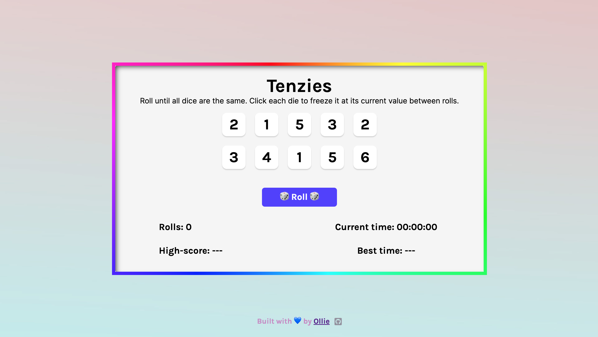
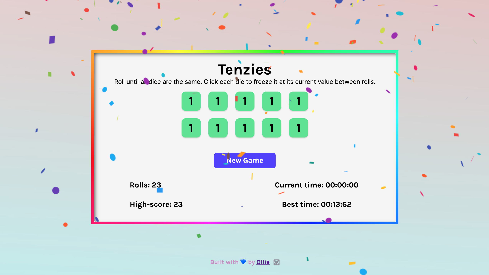

# Tenzies! 🎲 🎉

This repository contains the desing of a web app emulating the popular game 'Tenzies'. The goal is to get all die face displaying the same number/face in as little time & die rolls as possible. The key: you can 'lock in'/freeze a die face by clicking it. I made it as interactive as possible with several features, including high score recording, and celebrationary confetti!

Play the game here: https://olliequ.github.io/Tenzies/

## Technical Details

I wrote this game in ReactJS for the frontend, and Vite.js for the backend. Build instructions:

```
$ npm install
$ npm run start
```

Below are some screencaps from the game:


